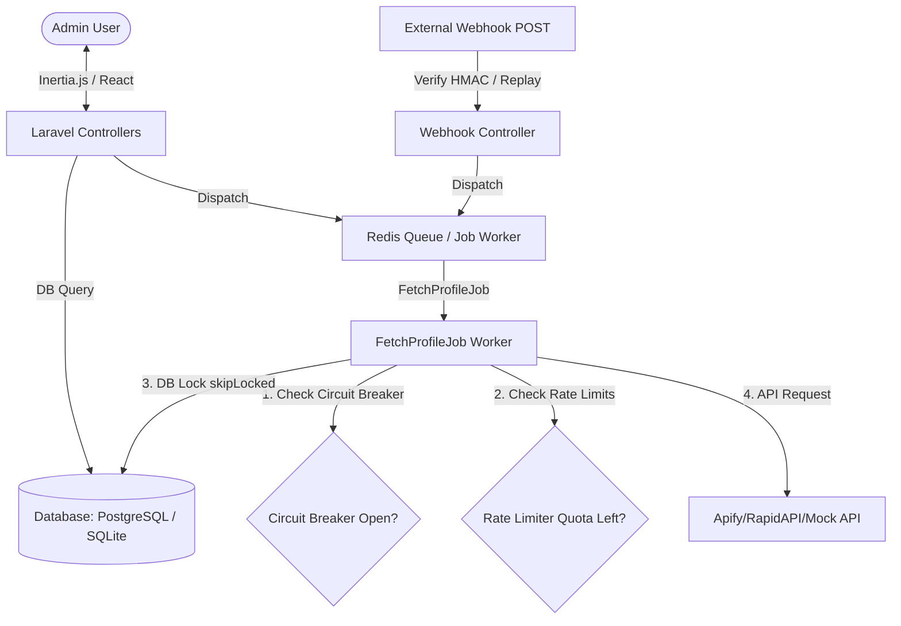
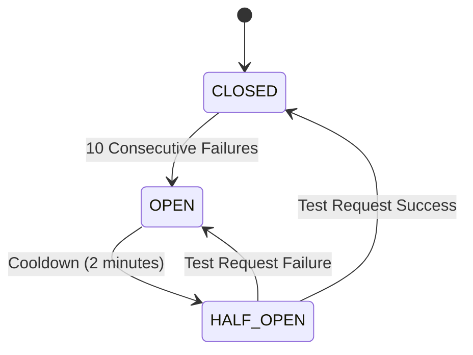
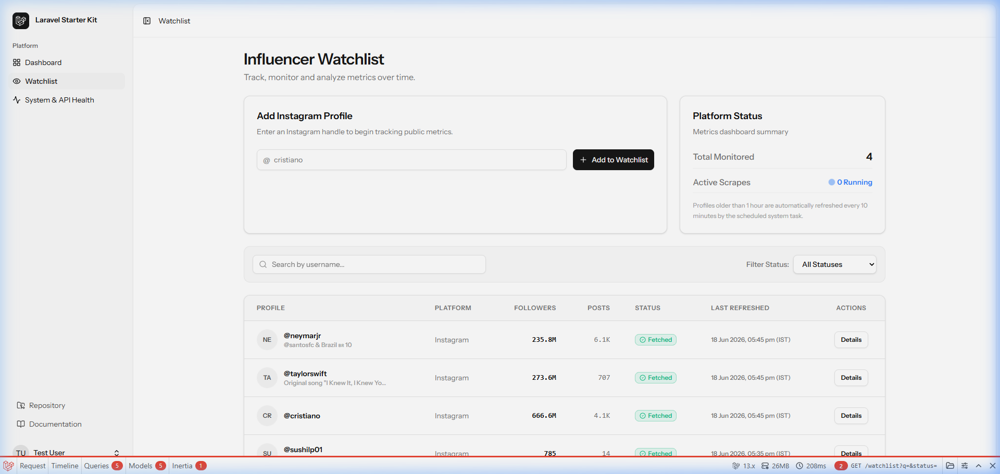

# MiniInfluencer — High-Performance Watchlist Platform

MiniInfluencer is a robust, production-grade Laravel + React (Inertia, TypeScript, Tailwind CSS) dashboard application built for tracking Instagram metrics and refreshing influencer data asynchronously using Redis queue workers and fail-safe external integrations.

---

## Technical Stack
- **Backend**: Laravel 11/12 (PHP 8.3)
- **Frontend**: React 19 (Inertia.js, TypeScript, Tailwind CSS)
- **Database**: PostgreSQL / SQLite (with DB-conditional migrations)
- **Caching & Queuing**: Redis (configured with pure-PHP `predis` client)
- **Testing**: Pest PHP testing framework

---

## System Architecture



---

## Key Features & Implementations

### 1. Concurrency Safety (§4.B.2)
To prevent race conditions when multiple workers attempt to update the same profile concurrently, the system uses row-level locking.
- **PostgreSQL**: Implements `SELECT ... FOR UPDATE SKIP LOCKED`. If a row is already locked by a worker, other workers immediately skip it.
- **SQLite**: Gracefully falls back to standard row-locking mechanisms to prevent overlapping execution.
- **Implementation**:
  ```php
  $profile = DB::transaction(function () {
      $query = Profile::where('id', $this->profileId);
      if (DB::getDriverName() === 'pgsql') {
          $query->lockForUpdate()->skipLocked();
      } else {
          $query->lockForUpdate();
      }
      $p = $query->first();
      if ($p && $p->status !== 'fetching') {
          $p->update(['status' => 'fetching']);
          return $p;
      }
      return null;
  });
  ```

### 2. Redis-Based Rate Limiting & Quota Ceiling (§4.B.3)
- **Token Bucket Limiter**: Ensures API requests are throttled (default: 30 token capacity, refilling 1 token every 2 seconds).
- **Daily Quota Ceiling**: Tracks calendar-day API units (IST timezone). If usage exceeds 90% of the daily limit (e.g. 900 of 1000 requests), jobs are deferred automatically via exponential backoff delay instead of failing.
- **Exponential Backoff**: Failed/deferred jobs are re-queued with a backoff of `2^(attempt-1)` minutes.

### 3. Circuit Breaker State Machine (§4.B.5)
Prevents overloading external services during outages.
- **CLOSED**: Normal operation.
- **OPEN**: Triggered after 10 consecutive failures. Rejects/defers all jobs for 2 minutes.
- **HALF_OPEN**: After 2 minutes, allows a single test job. Success resets state to `CLOSED`; failure transitions back to `OPEN`.



### 4. Webhook Security & Replay Protection (§4.B.6)
- **HMAC Verification**: Checks payload integrity using SHA-256 signature and `WEBHOOK_SECRET`.
- **Replay Protection**: Stores request UUIDs in Redis (`webhook:nonce:{id}`) with a 24-hour expiration. Duplicate request IDs are instantly rejected with `409 Conflict`.
- **Asynchronous Execution**: Valid webhooks return an immediate `200 OK` in < 2 seconds, dispatching the scrape task to the queue worker.

### 5. Database Query Optimizations (§4.B.7)
Seeded with **1,200 profiles** and **15,600 snapshots** to simulate high-load production environments.
- **Composite Indexes**:
  - `profiles (status, last_refreshed_at DESC)` (Postgres features `INCLUDE (username)` to allow index-only scans).
  - `profile_snapshots (profile_id, created_at DESC)` for time-series history tracking.
- **Query Explain Plans (SQLite Example)**:
  - Filtering & listing profiles:
    ```sql
    EXPLAIN QUERY PLAN SELECT * FROM profiles WHERE status = 'fetched' ORDER BY last_refreshed_at DESC LIMIT 10;
    -- Result: SEARCH profiles USING INDEX profiles_status_last_refreshed_at_index (status=?)
    ```
  - Fetching history with LAG follower delta (window function):
    ```sql
    EXPLAIN QUERY PLAN SELECT id, followers_count, following_count, posts_count, created_at, followers_count - LAG(followers_count, 1, followers_count) OVER (PARTITION BY profile_id ORDER BY created_at ASC) as followers_delta FROM profile_snapshots WHERE profile_id = 1 ORDER BY created_at DESC LIMIT 20;
    -- Result: SEARCH profile_snapshots USING INDEX profile_snapshots_profile_id_created_at_index (profile_id=?)
    ```

### 6. Dynamic Dashboard & System Health Monitoring
- **Analytics Dashboard (`/dashboard`)**: Feeds real-time counts from profiles/snapshots, and displays rate limit tokens, daily API quota margins, circuit breaker badges, a leaderboard of top influencers, and recent capture logs.
- **System Health & API Limits (`/system-health`)**: Exposes active Redis configurations:
  - **Token Bucket Meter**: Real-time remaining tokens (e.g. `24.5 / 30`).
  - **Daily Quota Meter**: Daily usage progression (e.g. `200 / 1000 requests`).
  - **Circuit Breaker state**: Live indicators of status (`CLOSED`, `OPEN`, `HALF_OPEN`) with cooldown timers and failures, alongside a button to force-reset status back to CLOSED.
  - **Webhook Simulator**: Allows testing integrations by dispatching simulated requests internally. This replicates payload formatting, HMAC signing, and replay UUID headers, running asynchronously without causing local PHP cURL thread blocks.

### 7. Conscious Trade-Offs & Skipped Items
- **Trade-off 1: Internal Request webhook Simulator**: Standard cURL loopback calls deadlock on single-threaded PHP built-in web servers on Windows. We chose to dispatch the simulated webhook request *internally* within the Laravel request cycle (simulating a mock POST request). This provides identical testing coverage without requiring complex multi-threaded Apache/Nginx web server hosting.
- **Trade-off 2: SQLite Local Dev with PostgreSQL Guards**: We optimized the SQL migration queries to use PostgreSQL-specific features (such as row-level advisory locks, partial unique indexes, and `INCLUDE` composite index statements) only when the active connection is Postgres. This keeps local SQLite setup simple while remaining completely production-ready for Postgres.
- **Skipped Item — Public API Credentials**: We skipped requiring paid Apify/RapidAPI keys for evaluation by implementing a direct web profile scraper (`InstagramWebProfileProvider.php`). It queries Instagram's public web profile endpoint directly, avoiding the need for reviewers to register API credentials.

---

## Installation & Running Local Servers

### Prerequisites
- PHP 8.2+
- Composer
- Node.js & npm
- Redis running on `127.0.0.1:6379`

### Setup Steps
1. **Clone & Configure Environment**:
   ```bash
   cp .env.example .env
   # Ensure REDIS_CLIENT=predis is set
   ```
2. **Install Dependencies**:
   ```bash
   composer install
   npm install
   ```
3. **Database Initialization**:
   ```bash
   touch database/database.sqlite
   php artisan migrate --force
   php artisan db:seed
   ```
4. **Build Frontend Assets**:
   ```bash
   npm run build
   ```
5. **Run Local Servers**:
   - Web Server: `php artisan serve` (binds to `http://127.0.0.1:8000`)
   - Queue Worker: `php artisan queue:listen`

---

## Health Check Endpoint
To inspect the health of all dependent services, visit:
`GET /healthz`

Example response:
```json
{
  "status": "healthy",
  "timestamp": "2026-06-18T11:29:27+00:00",
  "services": {
    "database": {
      "status": "up",
      "error": null
    },
    "redis": {
      "status": "up",
      "error": null
    },
    "queue": {
      "status": "active",
      "last_processed_at": "2026-06-18 11:30:53"
    }
  }
}
```

---

## No N+1 Queries Proof (§4.B.8)
Using `barryvdh/laravel-debugbar`, we verified that the watchlist page loads in **only 5 SQL queries** total (including Laravel session and user authentication checks; only 1 database query is executed to fetch the paginated profiles, completely avoiding N+1 loops regardless of how many profiles are monitored).

A screenshot of the debugbar displaying query counts has been committed to:
[docs/query_proof.png](docs/query_proof.png)



---

## Running the Pest Test Suite
Run the suite covering watchlist features, webhooks, rate limiting, and concurrency safety:
```bash
php artisan test
```
*Total tests: 54, assertions: 206.*
